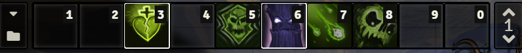
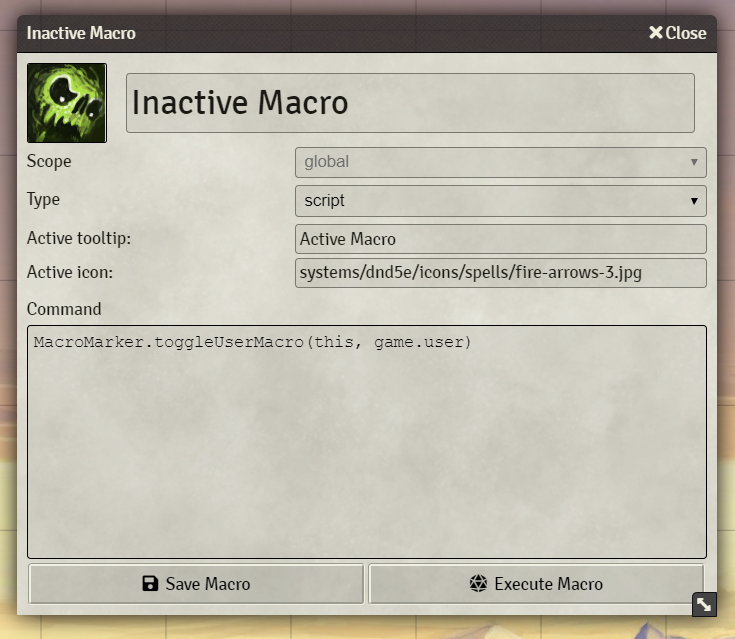
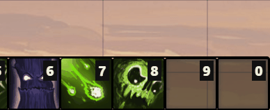

<h1 align="center">Macro Marker</h1>
<p align="center">
 
</p>

Using this Foundry VTT module, you can mark macros as active giving them a coloured border and an alternative icon.

Dimming the inactive macros is configurable in the module settings.

### Coloured active macros
<p align="center">

</p>

---

### Alternative icon and tooltip
<p align="center">

</p>
<p align="center">

</p>

---

## Usage
You can toggle the state on three levels:

```js
// Toggle only for the selected token
MacroMarker.toggleTokenMacro(macro, token, colour);

// Toggle only for the given user
MacroMarker.toggleUserMacro(macro, user, colour);  

// Toggle for the specific macro (for every user, independent of the selected token)
MacroMarker.toggleMacro(macro, colour);
```` 

Example usage inside a macro:
```js
// Use either this one:
MacroMarker.toggleTokenMacro(this, token, '#f37e44');

// or:
MacroMarker.toggleUserMacro(this, game.user); // default colour can be configured in settings

// or:
MacroMarker.toggleMacro(this, 'rgb(255, 243, 88)'); // any CSS colour is valid
```
