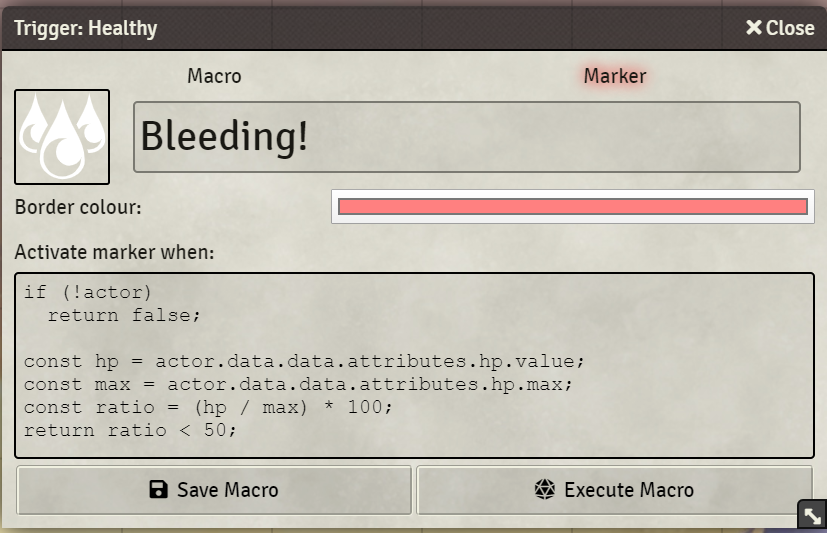
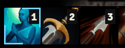

<h1 align="center">Macro Marker</h1>
<p align="center">
 
</p>

Using this Foundry VTT module, you can mark macros as active giving them a coloured border and an alternative icon.

Dimming the inactive macros is configurable in the module settings.

### Coloured active macros
<p align="center">

</p>

---

### Alternative icon and tooltip
<p align="center">

</p>
<p align="center">

</p>

---

### Optional animated border
<p align="center">

</p>

## Usage
The primary way to use this module, is to set a condition or trigger when the marker is activated. This is done in the macro configuration. This dialog now has an extra tab named "_marker_".

### Trigger-based toggles

The script will execute on any change to the character sheet, when the hotbar renders (e.g. on page changes) and when you select a token.

When the script returns `true`, the marker will be activated. When it returns `false`, it will be deactivated.

Like in the actual macro, you can use the `this` (current macro), `token` (selected token), `actor` (actor of selected token) and `character` (the user's character) variables.

Example:
The following trigger activates the marker when
a) a token is selected; and
b) the strength modifier is less than 0.
```js
if (!token)
  return false;

return actor.data.data.abilities.str.mod < 0;
```

If using a trigger like the one above is not an option, you can use flags instead.

### Flag-based toggles
You can toggle the state on one of three entities:

1. Macro
2. Token (or linked actor)
3. User

#### Macro
Toggling the state on the macro will make it visible for every user, irregardless of the token they have selected.

```js
MacroMarker.toggle(macro);
```

#### Token
Toggling the state on the token will make it visible for whoever controls the token. If the token is linked, the state will be synchronized across all other linked tokens of the same actor.

```js
let token = canvas.tokens.controlled[0];
MacroMarker.toggle(macro, { entity: token });
```

#### User
Toggling the state on the user will make it visible for only that user irregardless of the token they have selected.

```js
let user = game.user;
MacroMarker.toggle(macro, { entity: user });
```

### Manual toggles
Alternatively, you can manually activate and deactivate it, using the same function signature as the `toggle`  function.

```js
MacroMarker.activate(macro);
MacroMarker.deactivate(macro);

MacroMarker.activate(macro, { entity: user });
MacroMarker.deactivate(macro, { entity: token });
```

### Checking the state
Finally, you can also check the state:

```js
MacroMarker.isActive(macro);
MacroMarker.isActive(macro, { entity: token });
MacroMarker.isActive(macro, { entity: user });
```

### Marker configuration
You can configure an alternative tooltip, icon and colour when editing the macro.
